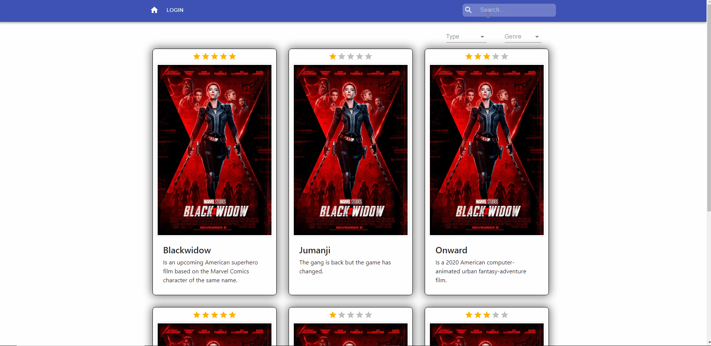
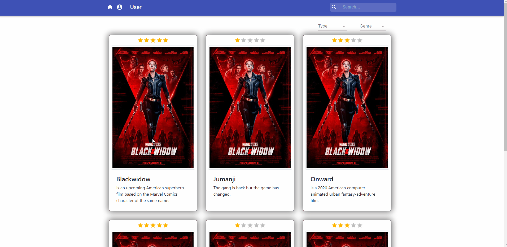

# Movies

Responsive project based on NodeJS, Express and React which you show movies data and if you register you can valorate the movie.

## 1. <a name='TableofContents'></a>Table of Contents

- 1. [Table of Contents](#TableofContents)
- 2. [Starting 🚀](#Starting)
     - 2.1. [Pre-requisites 📋](#Pre-requisites)
     - 2.2. [Instalation 🔧](#Instalation)
     - 2.3. [Users 📋](#Users)
- 3. [Running the test ⚙️](#Runningthetest)
- 4. [Buildin with 🛠️](#Buildinwith)
- 5. [Proyect Structure 📦](#Structure)
- 6. [How to use the web 📖](#HowToUse)

## 2. <a name='Starting'></a>Starting 🚀

You have available the next scripts to develop:

- start:dev: local server up to development (Previously you need runs the mocks server to show information).\
  URL: [localhost:9002](http://localhost:9002/)
- mockServer: local mock server up to development API.

Other script:

- start: local server up with Production config.\
  URL: [localhost:8080](http://localhost:8080/)
- build: generates the distribution of production.

### 2.1. <a name='Pre-requisites'></a>Pre-requisites 📋

We must have installed in the system

- Node 10.16.1
- Yarn (Optional)

### 2.2. <a name='Instalation'></a>Instalation 🔧

Launch in the console:

```
npm install or yarn install
```

### 2.3. <a name='Users'></a>Users 📋

The users you can use to log into the web: (Example: user / password)

- user / aA123

## 3. <a name='Runningthetest'></a>Running the test ⚙️

```
yarn test
```

Launches the test runner in the interactive watch mode.\
See the section about [running tests](https://facebook.github.io/create-react-app/docs/running-tests) for more information.

## 4. <a name='Buildinwith'></a>Buildin with 🛠️

- [React](https://es.reactjs.org/) - JS Library for building UI
- [React-router](https://reactrouter.com/) - Collection of navigational components
- [Axios](https://github.com/axios/axios) - Promise based HTTP client for the browser and node.js
- [MaterialUI](https://material-ui.com/) - React components for faster and easier web development.
- [Bootstrap](https://getbootstrap.com/) - Front-end open source toolkit.
- [Sass](https://sass-lang.com/) - Css extension
- [Express](https://expressjs.com/) - Web infrastructure with node js

## 5. <a name='Structure'></a>Proyect structure 🛠️

> 📦src\
> ┣ 📂app\
> ┃ ┣ 📂pages\
> ┃ ┗ 📜App.tsx\
> ┣ 📂assets\
> ┃ ┗ 📂images\
> ┣ 📂components\
> ┃ ┣ 📂commons\
> ┃ ┣ 📂Layout\
> ┃ ┗ 📂Router\
> ┣ 📂interfaces\
> ┣ 📂services\
> ┃ ┣ 📂axios_service\
> ┃ ┣ 📂context\
> ┃ ┣ 📂hooks\
> ┃ ┗ 📂providers\
> ┣ 📂stylesheets\
> ┃ ┣ 📂abstracts\
> ┃ ┣ 📂components\
> ┃ ┣ 📂layout\
> ┃ ┣ 📂pages\
> ┃ ┗ 📜main.scss\
> ┣ 📂utils\
> ┃ ┗ 📜endpoints.js\
> ┗ 📜index.tsx

## 6. <a name='HowToUse'></a>How to use the web 📖

- ### Filter Movies:
  On the main screen you can filter movies by genre or type. You can select the genre or type and the movies will be filtered at the moment.\
  Also you can filter with name in the search input. You can see the gif for more information. \
   
- ### Rate Movies:
  You can rate movies; To do this, select the stars on the movie card. But only you can rate movies if you are logged. \
   
- ### Detail Movies:
  If you want to see the movie details, you can click the movie card to go to the movie details. \
  If you want logout you clicked in the user icon and select logout.\
   
